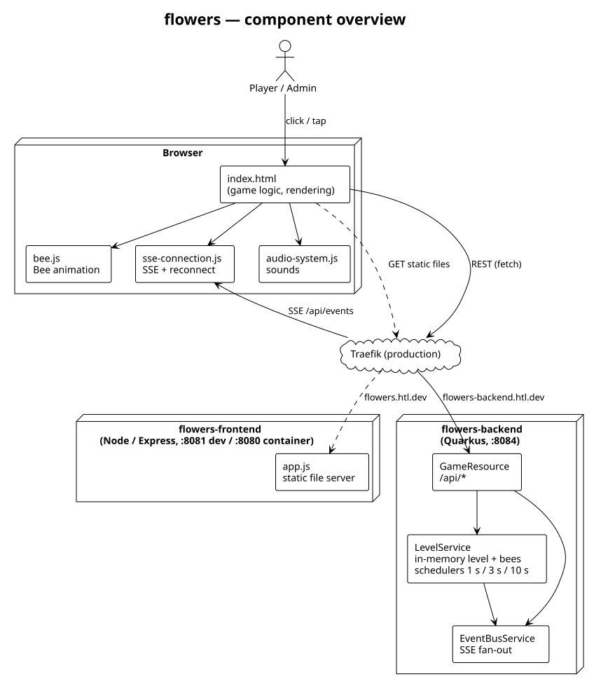
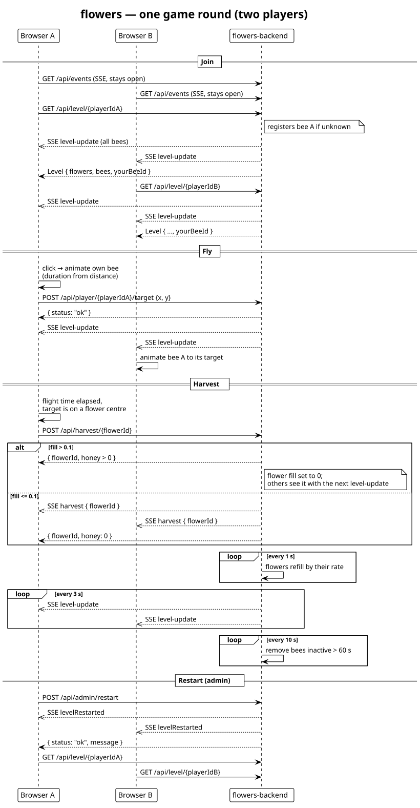

# flowers-backend

Backend of **flowers**, a small multiplayer browser game used for teaching at HTL: every player
steers a bee across a meadow and harvests honey from flowers. All players share one level; every
change is pushed to all browsers via Server-Sent Events (SSE).

- Frontend: [guFalcon/flowers-frontend](https://github.com/guFalcon/flowers-frontend)
- Live game: <https://flowers.htl.dev> (admin view: `https://flowers.htl.dev/?admin=<admin token>`)
- Live backend: <https://flowers-backend.htl.dev>

Java 21, [Quarkus](https://quarkus.io/) (REST + Jackson, Mutiny, Scheduler), Lombok. All game state
lives in memory — there is no database, and a restart of the backend starts a fresh level.



## Game mechanics

- A **level** is a 9:16 meadow with 6–11 randomly placed **flowers**. Positions and sizes are
  relative (`0..1`) so every screen size shows the same level.
- Each flower has a nectar `fill` (`0..1`) that grows by its own `rate` **every second**, up to 1.
- A **bee** is created for every player id the first time the player loads the level or sets a
  target. It gets a random colour and appears standing still at a random position with 0 honey.
- Players move their bee by setting a **target**. The server simulates the flight: a straight line
  from the bee's current position at constant speed, taking `max(5 s × distance, 0.2 s)` (distance in
  relative coordinates) — the same duration the browser animates. Other players see the new target
  with the next `level-update`.
- **Harvesting** is requested by the player after the flight; the server decides. It succeeds if the
  bee has arrived (the request may come up to 500 ms early) and a flower centre is within
  `0.175 × size` of the bee (the drawn flower centre; horizontal distances converted with 9:16). The
  closest such flower with `fill > 0.1` yields `round(fill² × 1000)` honey and is emptied; otherwise
  the harvest yields 0. The server keeps every bee's honey, so it survives a page reload.
- Every **10 seconds** bees whose player has not set a target for **60 seconds** are removed.
- The whole level is broadcast **every 3 seconds** and additionally whenever a bee is added,
  moved or removed.
- An **admin restart** generates new flowers and resets every bee's honey to 0; the bees stay
  where they are.



## REST API

All endpoints live under `/api`, send and receive JSON. Players are not authenticated; admin
endpoints (`/api/admin/*`) require the header `X-Admin-Token` (see [Admin token](#admin-token)).

| Method | Path | Body | Response | Effect |
|---|---|---|---|---|
| `GET` | `/api/level/{playerId}` | – | `Level` with `yourBeeId` | Registers a bee for `playerId` if unknown, returns the current level |
| `POST` | `/api/player/{playerId}/target` | `{"x": 0.5, "y": 0.5}` | `{"status": "ok"}` | Sets the bee's target (registers the bee if unknown), broadcasts `level-update` |
| `POST` | `/api/player/{playerId}/harvest` | – | `{"flowerId": "flower-0", "gained": 250, "total": 650}` | Harvests the flower under the bee, see [Game mechanics](#game-mechanics); broadcasts `harvest` if `gained > 0`; `404` for an unknown bee |
| `POST` | `/api/admin/restart` | – (header `X-Admin-Token`) | `{"status": "ok", "message": "Level restarted"}` | New flowers, honey reset, broadcasts `levelRestarted`; `403` without a valid token |
| `GET` | `/api/events` | – | SSE stream (`text/event-stream`) | See [SSE events](#sse-events) |

`playerId` is any string; the frontend uses a UUID kept in `localStorage`. A harvest that yields
nothing answers `gained: 0` with the id of the flower under the bee, or `flowerId: null` if there is
none; `total` is always the bee's honey after the request.

`Level`:

```json
{
  "aspect": "9:16",
  "flowers": [
    {
      "id": "flower-0", "x": 0.98, "y": 0.01, "size": 0.087,
      "petals": 5, "color": "lightgreen",
      "petalColors": ["#A0FAA2", "#92DD8D", "#9FF1A2", "#8FDF86", "#7EE188"],
      "stampColor": "#7BD97E", "fill": 1.0, "rate": 0.033
    }
  ],
  "bees": [
    {
      "id": "3f0c…", "x": 0.41, "y": 0.77, "targetX": 0.5, "targetY": 0.5,
      "color": "#E6A4D9", "lastActive": 1791273600000, "honey": 650
    }
  ],
  "yourBeeId": "3f0c…"
}
```

`x`, `y`, `size`, `targetX`, `targetY` are relative to the play area (`size` relative to its
height); `rate` is the fill increase per second. `x`/`y` of a bee are its current position on its
flight when the level was built, `honey` its score. `yourBeeId` is set only in the response of
`GET /api/level/{playerId}`.

## SSE events

`GET /api/events` keeps the connection open and sends one JSON object per `data:` line. The `type`
field tells the events apart:

| `type` | Fields | When |
|---|---|---|
| `level-update` | `level`: the `Level` (without a meaningful `yourBeeId`) as a JSON object | Every 3 s, and when a bee is added, moved or removed |
| `harvest` | `flowerId`, `fill` (0) | After a harvest that yielded honey |
| `levelRestarted` | – | After `POST /api/admin/restart`; clients reload the level |

```text
data:{"type":"levelRestarted"}
data:{"type":"harvest","flowerId":"flower-3","fill":0}
data:{"type":"level-update","level":{"aspect":"9:16","flowers":[…],"bees":[…],"yourBeeId":null}}
```

Watch the stream by hand with `curl -N http://localhost:8084/api/events`.

## Admin token

`/api/admin/*` is guarded by `AdminTokenFilter`: a request is executed only if its `X-Admin-Token`
header equals the token from the environment variable `FLOWERS_ADMIN_TOKEN` (config property
`flowers.admin-token`); otherwise it is answered with `403`. Without a configured token every admin
request is refused. In `quarkus:dev` the token is `dev-admin-token`, in tests `test-admin-token`.

The frontend's admin view is opened with `?admin=<token>` and sends the token along. In production
the token is the GitHub secret `FLOWERS_ADMIN_TOKEN` of this repo; the pipeline hands it to the
shared `deploy-workflow` as `EXTRA_ENV`, which appends it to `deploy/.env`, and
`deploy/docker-compose.yml` passes it into the container. To rotate it, change the secret and
redeploy.

## Local development

Requirements: JDK 21 (Lombok 1.18.38 does not compile on newer JDKs — set `JAVA_HOME` to a JDK 21
if your default is newer) and Docker only for image builds. Maven comes with the wrapper.

```shell
./mvnw quarkus:dev
```

- Backend: <http://localhost:8084>
- Swagger UI: <http://localhost:8084/q/swagger-ui/> (OpenAPI document at `/q/openapi`)
- Dev UI: <http://localhost:8084/q/dev-ui/>

Configuration is in `src/main/resources/application.properties`:

| Property | Value | Purpose |
|---|---|---|
| `quarkus.http.port` | `8084` | HTTP port |
| `quarkus.http.cors.origins` | `https://flowers.htl.dev, http://localhost:8080, http://localhost:8081` | Browser origins allowed to call the API — add yours when the frontend runs elsewhere |
| `flowers.admin-token` | `${FLOWERS_ADMIN_TOKEN:}` (`%dev`: `dev-admin-token`) | Admin token, see [Admin token](#admin-token) |

To play against the local backend, run the frontend on port 8081 and point its `SERVER` constant
at `http://localhost:8084` (see the frontend README).

Tests (JUnit 5, AssertJ, `@QuarkusTest`): `./mvnw test`. `http/game.http` exercises the REST API
against `quarkus:dev`.

## Build and deployment

```shell
./mvnw package -DskipTests
docker build -f src/main/docker/Dockerfile.jvm -t flowers-backend:local .
docker run --rm -p 8084:8084 flowers-backend:local
```

Every push to `main` runs `.github/workflows/pipeline.yml`:

1. bump the semantic version (shared `bump-semver-workflow`),
2. `mvn package -DskipTests` on a self-hosted runner (tests are not run in CI),
3. build the image from `src/main/docker/Dockerfile.jvm` and push it to Docker Hub as
   `gufalcon/flowers-backend:latest`,
4. deploy with the shared `deploy-workflow`, which writes `deploy/.env` (including
   `FLOWERS_ADMIN_TOKEN`) and runs `deploy/up.sh` (`docker-compose pull && up`) on the server. `deploy/docker-compose.yml` puts the container into the external Traefik network
   `proxy_default` and routes `flowers-backend.htl.dev` to port 8084.

## Repository layout

| Path | Content |
|---|---|
| `src/main/java/info/unterrainer/htl/resources/GameResource.java` | REST and SSE endpoints |
| `src/main/java/info/unterrainer/htl/resources/AdminTokenFilter.java` | Admin token check for `/api/admin/*` |
| `src/main/java/info/unterrainer/htl/services/LevelService.java` | Level, bees, flight simulation, harvesting, scheduled fill / cleanup / broadcast |
| `src/main/java/info/unterrainer/htl/services/EventBusService.java` | Fan-out of events to all SSE clients |
| `src/main/java/info/unterrainer/htl/dtos/` | `Level`, `Flower`, `Bee`, `HarvestResult` |
| `src/main/java/info/unterrainer/htl/ColorUtils.java` | Flower and bee colours |
| `src/main/docker/` | Dockerfiles (`Dockerfile.jvm` is the one CI uses) |
| `deploy/` | docker compose file and `up.sh` used by the deploy workflow |
| `docs/diagrams/` | PlantUML sources (`.puml`) and rendered SVGs |
| `openspec/` | [OpenSpec](https://github.com/Fission-AI/OpenSpec) specs and changes for **both** repos |
| `http/` | `.http` request files for the REST API (added with the first REST change) |
| `ai/` | Working notes for the AI assistant: memory and the backlog `ai/open-proposals.md` |

Diagrams are rendered with:

```shell
curl -sS -L -X POST -H 'Content-Type: text/plain; charset=utf-8' \
  --data-binary @docs/diagrams/game-round.puml \
  https://plantuml.unterrainer.info/plantuml/svg -o docs/diagrams/game-round.svg
```
